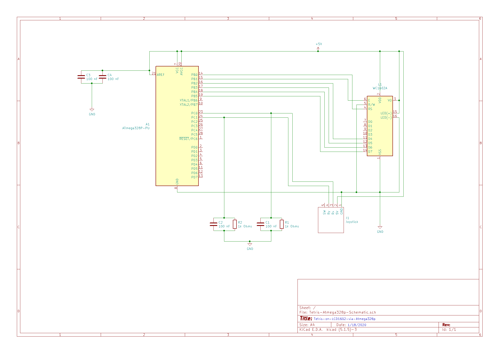

# tetris-on-lcd1602-via-atmega328p
Program which executes Tetris on an LCD1602 display via Atmega328p microcontroller and joystick for user input.

## Instructions:
1. Compile main.c using Atmel Studio 7 or similar method and program resulting .hex file in atmega328p's flash memory
2. Manipulate falling tetromino block via the following actions on joystick:
	* Move joystick up    --> Rotate tetromino block
	* Move joystick left  --> Move tetromino block left
	* Move joystick right --> Move tetromino block right
	* Move joystick down  --> Move tetromino block down
3. Tetris will continually be executed on LCD display till circuit is powered off. 
4. Upon circuit being powered on, tetris will start executing on LCD display after a slight delay.

## Circuit Schematic:

